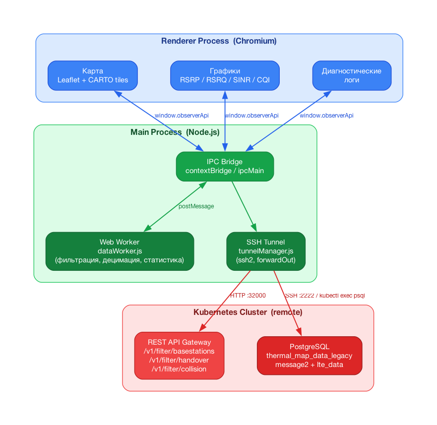

# Radio Backend Observer

Десктопное приложение для мониторинга и анализа параметров радиоинтерфейса сети мобильной связи LTE на основе данных пользовательских устройств.

Разработано в рамках дипломной работы на кафедре ПОМС  
**Сибирский государственный университет телекоммуникаций и информатики (СибГУТИ)**

---

## Архитектура



Система построена на трёх уровнях:

- **Уровень отображения** — процесс рендерера Electron: карта (Leaflet), графики (Canvas API), логи
- **Уровень обработки** — главный процесс Node.js: SSH-туннель, IPC, Web Worker для фильтрации и статистики
- **Уровень данных** — кластер Kubernetes: PostgreSQL с измерениями UE, REST API шлюза

---

## Возможности

### Карта
- Тепловая карта точек измерений с окраской по RSRP
- Трек передвижения устройства с автоматическим разрывом при пропусках > 1 км
- События хэндовера от API бэкенда
- Базовые станции (eNodeB) с полигонами секторов покрытия
- Зоны PCI-коллизий (mod 3 / mod 6)
- Двухручечный слайдер временного диапазона (с 2024 по текущую дату)
- Фильтрация по оператору (MNC) и порогам RSRP/RSRQ
- Светлая/тёмная тема карты синхронизирована с темой приложения

### Графики радиопараметров
Поддерживаемые метрики: **RSRP, RSRQ, SINR, RSSI, CQI, PCI, CI**

Типы визуализации для каждой метрики:
- Временной ряд с маркерами хэндоверов и пороговыми линиями 3GPP
- Гистограмма (24 бина)
- Эмпирическая функция распределения (CDF)
- Диаграмма рассеяния (корреляция пар параметров)

Сводный блок KPI: медиана, P10/P90, число хэндоверов, число уникальных ячеек.

### Доступ к данным
- Защищённое SSH-туннелирование к кластеру Kubernetes
- SQL-запросы через `kubectl exec` к поду PostgreSQL
- Данные о БС, хэндоверах и коллизиях — от REST API (`/v1/filter/*`)
- Режим синтетической базы данных для работы без подключения к инфраструктуре

---

## Стек

| Компонент | Технология |
|---|---|
| Десктоп-оболочка | Electron |
| Карта | Leaflet + CARTO tiles |
| Графики | Canvas API (без сторонних библиотек) |
| Доступ к данным | SSH + kubectl + psql |
| Обработка данных | Web Worker |
| База данных | PostgreSQL (удалённый кластер) |

---

## Запуск (dev)

```bash
npm install
npm run dev
```

Скопируй `.env.example` в `.env` и заполни своими значениями:

```bash
cp .env.example .env
```

Ключевые переменные:

```env
SSH_HOST=your.server.host
SSH_USER=your_user
SSH_PASSWORD=your_password
API_BASE=http://127.0.0.1:13200/api
USE_SYNTHETIC_DB=false
```

---

## Сборка релизов

```bash
npm run dist:mac     # macOS — DMG + ZIP (x64, arm64)
npm run dist:win     # Windows — portable EXE (x64)
npm run dist:linux   # Linux — AppImage (x64)
```

Артефакты сохраняются в папку `dist/`.  
`.env` упаковывается внутрь приложения через `extraResources` и читается при старте.

---

## Структура проекта

```
├── main.js              # Главный процесс Electron (IPC, SSH, DB)
├── tunnelManager.js     # Управление SSH-туннелями
├── syntheticDb.js       # Синтетическая база данных
├── preload.js           # contextBridge для renderer
├── renderer/
│   ├── index.html       # UI
│   ├── renderer.js      # Логика интерфейса, карта, графики
│   ├── dataWorker.js    # Web Worker: обработка данных
│   └── styles.css       # Стили
├── scripts/
│   └── buildSyntheticData.js   # Генерация синтетического датасета
├── electron-builder.yml # Конфигурация сборки
└── .env.example         # Шаблон конфигурации окружения
```
